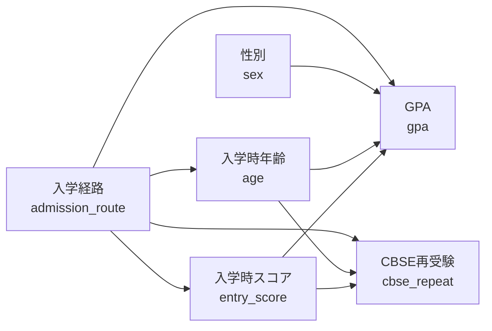

# medical_education_admissions

医学教育者向けの R ハンズオン用練習プロジェクト。**入学経路と人口統計学的要因が学業成績に与える影響を後ろ向きコホートで評価する**、という医学教育研究の典型的なシナリオを題材にしている。

## 元論文（仮想データのモデル）

> Behnam et al. **Admission Routes and Demographics as Predictors of Academic Performance in Medical Students: A Retrospective Cohort of GPAs and Comprehensive Exam Scores.** *Advances in Medical Education and Practice (AMEP)*, published online 2026-03-02. DOI: 10.2147/AMEP.S574930.

設定: Tehran University of Medical Sciences (TUMS) における後ろ向きコホート (n=1,727)。
このプロジェクトの `data/processed/sample.csv` は、上記論文のデータ構造を模した **n=200 の仮想データ** (`set.seed(20260513)`)。実データではないことに注意。

### 元論文の PECO

| 要素 | 内容 |
|------|------|
| **P** (Population) | Tehran University of Medical Sciences (TUMS) の医学部生 n=1,727（2019年夏学期〜2022年冬学期入学コホート） |
| **E** (Exposure) | 入学経路（一般入試 Konkur 以外：Special／SemiSpecial／Olympiad）／ CBSE 再受験経験 ／ 入学時年齢 ／ 性別 |
| **C** (Comparison) | 一般入試 (Konkur) ／ CBSE 一発合格者 ／ 年齢の若い群 ／ 男性 |
| **O** (Outcome) | 累積 GPA（連続）／ CBSE (Comprehensive Basic Sciences Exam) スコア（連続）または合格 (2値) |

主な所見:

- CBSE 再受験者は、一発合格者と比べて GPA・CBSE スコアが有意に低い
- 再受験を繰り返すほど入学時年齢が高い (P<0.001)
- 入学経路で学業成績に差がある（Olympiad／Special／SemiSpecial は一般入試より高めの傾向）

### 元論文の DAG（再構成）

> **注**: 元論文に DAG の図示はない。本プロジェクトでは、午前コマ「量的研究概論」で扱った DAG の練習素材として、論文の解析構造から因果関係を再構成した。`data/raw/generate_sample_data.R` の生成モデルは、この DAG に沿っている。



DAG の読み方（午前コマと接続）:

- **曝露**: `admission_route`（入学経路）／**主要アウトカム**: `gpa`
- `entry_score` と `age` は **`admission_route` の下流（媒介因子）** にある（Olympiad は若くて入学時スコアが高い、など）
- 本プロジェクトの重回帰 `lm(gpa ~ admission_route + age + sex + entry_score)` は媒介因子を「調整」しているので、推定しているのは **入学経路の直接効果**。**総効果**を見たければ媒介因子は調整しない、という選択肢があり得る — これは午前コマの **backdoor 基準・媒介因子論** と接続する論点
- `cbse_repeat` は `gpa` の下流のように見えがちだが、本データ生成モデルでは `gpa` ではなく共通の上流（`admission_route`, `age`, `entry_score`）を経由して相関する設計

## ディレクトリ構成

```
medical_education_admissions/
├── README.md                          # このファイル
├── check_environment.R                # 事前課題：環境動作確認スクリプト
├── data/
│   ├── raw/
│   │   └── generate_sample_data.R     # sample.csv を再現生成するスクリプト
│   └── processed/
│       └── sample.csv                 # n=200 仮想データ（受講生はこれを読む）
├── scripts/                           # 受講生の作業ファイル置き場（空）
└── output/
    ├── figures/                       # 受講生が作る図（空）
    └── tables/                        # 受講生が作る表（空）
```

`analysis.Rmd` は **置いていない**。WS 当日、受講生が AI と対話しながらゼロから書く。

## 環境設定 / 動作確認

### 必要パッケージ

このプロジェクトで使うのは以下。**親リポジトリ ([SRWS-PSG/r-environment-for-researcher](https://github.com/SRWS-PSG/r-environment-for-researcher)) の `renv.lock` にすべて含まれている**ので、`renv::restore()` を一度通せば追加インストールは不要のはず。

| パッケージ | 用途 | 親リポの renv |
|------------|------|---------------|
| `rmarkdown` | Rmd → HTML への knit | ◯ |
| `knitr` | code chunk 実行 | ◯ |
| `gtsummary` | Table 1 / 回帰表 (`tbl_regression`) | ◯ |
| `dplyr` | データ操作 | ◯ (tidyverse 経由) |
| `broom` | `lm` の整形 (`tbl_regression` の内部でも利用) | ◯ (tidyverse 経由) |
| `ggplot2` | ヒストグラム等 | ◯ (tidyverse 経由) |

> ⚠️ **AI が `epitools` `epiR` `gmodels` 等の新規パッケージを提案してきても断る。**
> リスク比・オッズ比は **base R + 上記 6 パッケージ** で完結させる (式は §Task 2 に明記)。
> 依存を増やすと WS 当日の `install.packages` で詰まるリスクがある。

### 事前課題（受講生用、当日までに済ませる）

**ここまで**を当日までに各自で済ませる。コードは書かなくて OK。

1. **[Antigravity](https://antigravity.google/) のインストール** — AI コーディング IDE（このコース全体で使う）
2. **GitHub アカウント + 認証設定** — Antigravity / コマンドラインから push できるところまで（PAT or SSH 鍵）
3. **R 本体のインストール** — 4.4 以上を推奨

**fork / clone / setup.sh / 動作確認は当日 WS の冒頭 30 分でみんなで一緒にやる**ので、事前にはやらなくて良い（事故防止のため、わざと当日に揃えてやる）。

### 当日 WS のセットアップ（参考）

WS 冒頭で講師の合図とともに全員一斉に実行する3ステップ。

```bash
# (a) GitHub でフォークのリポジトリ画面を開いて Fork ボタン
#     → 自分のアカウントに <フォーク名> ができる

# (b) Antigravity 内蔵ターミナル（または通常のターミナル）で clone
git clone https://github.com/<自分のID>/<フォーク名>.git
cd <フォーク名>

# (c) 環境セットアップを起動（バックグラウンド OK、5〜10 分）
bash setup.sh
```

setup.sh が走っている間に圧縮レクチャー（変数の型・p値・お経表）。終わったら動作確認:

```r
source("projects/medical_education_admissions/check_environment.R")
```

このスクリプトは以下を確認する:

- 必要パッケージ 6 本がインストール済みか
- `data/processed/sample.csv` が読み込めるか（n=200, 8 列）
- `pandoc` が見えているか（knit に必要）
- `LC_CTYPE` ロケールが日本語表示できる設定か（プロット日本語ラベル対策）

すべて `[OK]` が出れば本編ハンズオンへ。トラブル時は **エラーメッセージごと AI に貼って質問** が最速。

### ハマりどころ（事前に共有）

| 症状 | 原因 | 対処 |
|------|------|------|
| `cannot find file 'data/processed/sample.csv'` | knit 時の作業ディレクトリが想定と違う | `analysis.Rmd` は `projects/medical_education_admissions/` 直下に置く。または `here::here("projects/medical_education_admissions/data/processed/sample.csv")` を使う |
| `gtsummary` の Table 1 で日本語が文字化け | Windows 既定ロケールが Shift_JIS | `Sys.setlocale("LC_CTYPE", "Japanese_Japan.utf8")` を chunk 冒頭に置く、または変数ラベルを英語で書く |
| `pandoc not found` で knit 失敗 | RStudio 経由でなく素の R から knit している | RStudio の Knit ボタンを使う、または `rmarkdown::pandoc_available()` で確認 |
| `package 'gtsummary' not found` | `renv::restore()` がまだ走っていない | リポジトリルートで `renv::restore()` を実行 |
| `'CBSE' は printable な文字でない` 系の警告 | CSV のエンコーディング | `read.csv("...", fileEncoding = "UTF-8")` を明示 |

## 変数辞書 (`data/processed/sample.csv`)

| 変数 | 型 | 内容 | 取りうる値 |
|------|----|------|-----------|
| `id` | int | 学生ID | 1〜200 |
| `age` | 連続 | 入学時年齢 (歳) | おおむね 18〜30 |
| `sex` | 2値 | 生物学的性別 | `M` / `F` |
| `admission_route` | カテゴリ | 入学経路 | `General` (一般入試) / `Special` / `SemiSpecial` / `Olympiad` |
| `entry_score` | 連続 | 入学時試験スコア (100点満点) | おおむね 40〜100 |
| `cbse_repeat` | 2値 | CBSE 再受験経験 | 0 (一発合格) / 1 (再受験あり) |
| `gpa` | 連続 | GPA (20点満点) | おおむね 10〜20 |
| `pass_cbse` | 2値 | CBSE 一発合格 | 0 (再受験) / 1 (一発合格) |

**注**: `cbse_repeat` と `pass_cbse` は同じ情報の表裏（`pass_cbse = 1 - cbse_repeat`）。WS では用途に応じて使い分ける。

## ワークショップ課題（受講生用）

「お経」表のセルを埋めるように、以下の解析を AI と対話しながら `analysis.Rmd` に書き、knit して HTML レポートを生成する。

### Task 1: データを読む・記述する (Table 1)

- `data/processed/sample.csv` を読み込み、各変数のヒストグラム or 頻度集計を出す
- `gtsummary::tbl_summary(by = admission_route)` で入学経路別 Table 1 を作る
- **連続変数は `mean (SD)` で表記する**。`±` 記号は使わない (AMA / BMJ スタイル準拠、SD と SEM と 95%CI が `±` だと区別できなくなるため)
  - `gtsummary` のデフォルトは `median (IQR)` なので、明示的に指定する:

  ```r
  tbl_summary(
    by = admission_route,
    statistic = list(all_continuous() ~ "{mean} ({sd})"),
    digits    = list(all_continuous() ~ 1)
  )
  ```

### Task 2: 単変量解析

- **t検定**: 一般入試 vs それ以外 で `gpa` に差があるか
  - ヒント: `admission_route` を 2値 (`General` vs それ以外) に変換するところから
- **$\chi^2$検定 + リスク比 (RR) と 95%CI**: 入学経路（2値）と `cbse_repeat` の関連
  - p 値: `chisq.test(table(...))`
  - RR + 95%CI は **base R で計算** (epitools 等は使わない)。次の関数を AI に書いてもらえば OK:

  ```r
  rr_ci <- function(a, n1, b, n2) {
    # a: 群1 のイベント数, n1: 群1 の人数, b: 群2 のイベント数, n2: 群2 の人数
    rr <- (a / n1) / (b / n2)
    se_log_rr <- sqrt(1/a - 1/n1 + 1/b - 1/n2)
    ci <- exp(log(rr) + c(-1.96, 1.96) * se_log_rr)
    c(RR = rr, lower = ci[1], upper = ci[2])
  }
  # 使い方:
  # tab <- table(d$admission_route_binary, d$cbse_repeat)
  # rr_ci(a = tab["General","1"], n1 = sum(tab["General",]),
  #       b = tab["Other",  "1"], n2 = sum(tab["Other",  ]))
  ```

### Task 3: 多変量解析

- **重回帰**: `gpa` を、`admission_route_binary + age + sex + entry_score` で説明する
  - モデル: `fit <- lm(gpa ~ admission_route_binary + age + sex + entry_score, data = d)`
  - 整形は **`gtsummary::tbl_regression(fit)`** に統一 (係数・95%CI・p 値の表が一発で出る)
  - 内部で `broom::tidy()` を呼んでいるので、broom を直接叩いても同じ数字になる

### Task 4: knit して HTML レポートにする

- RStudio の Knit ボタン or `rmarkdown::render("analysis.Rmd")`
- エラーが出たら AI にエラーメッセージごと貼って質問する

## AI に聞く時のコツ（雛形）

```
このリポジトリの projects/medical_education_admissions/data/processed/sample.csv を
読み込んで、変数 admission_route 別の Table 1 を gtsummary で作る Rmd チャンクを
書いてください。連続変数は mean (SD) で出してください
(statistic = list(all_continuous() ~ "{mean} ({sd})") を使い、± 記号は避けてください)。
私は R 初心者なので、各行に何をしているかコメントを付けてください。
```

```
今の sample データで、admission_route が "General" かそれ以外かで gpa に
差があるかを t検定で調べたいです。R のコードを書いてください。
```

```
重回帰 lm(gpa ~ admission_route_binary + age + sex + entry_score) の出力を、
論文の Table 2 のように 95%CI と p値を含む整った表にしたいです。
gtsummary::tbl_regression() を使った chunk を書いてください
(broom などの追加パッケージは不要です)。
```

```
knit したら次のエラーが出ました。直してください。
[エラーメッセージをそのまま貼る]
```

## 「お経」表（変数型 × 解析）

| アウトカム変数 | 2値 | 連続 | 生存時間 |
|----------------|-----|------|----------|
| 分布の記述 | 頻度集計・分割表 | ヒストグラム、平均 (SD) | Kaplan-Meier法 |
| 単変量解析 | $\chi^2$検定（or Fisher）／リスク比 | t検定／平均差 | Log-rank／率比 |
| 多変量解析 | ロジスティック回帰 | **重回帰** | Cox回帰 |

このプロジェクトで動かすのは太字（記述 + t検定 + $\chi^2$ + 重回帰）。生存解析はスコープ外。準実験法（DiD, ITS）は別プロジェクト／別コマで扱う。

## データを再生成する場合

```r
source("data/raw/generate_sample_data.R")
# data/processed/sample.csv が上書きされる
```

`set.seed(20260513)` 固定なので、何度実行しても同じ CSV が得られる。
